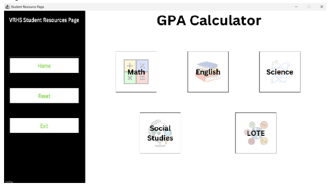

## PROJECT TITLE:
Student GPA Calculator Application

## PURPOSE OF PROJECT:
To provide students in Leander Independent School District with a more convenient interface to calculate their final weighted GPAs according to the district-wide [calculation policy](https://www.leanderisd.org/classranking/) 

## USER INSTRUCTIONS:
1) Once the application is opened, you should see the home screen.

2) Click on the GPA Calculator.

3) Once in the GPA Calculator application, select a subject for which you would like to enter your grades.

4) Next, click the Add New Course button on the left taskbar.

5) After being prompted with a field to enter relevant course information, users will enter the course level that matches the format. When prompted for semester grades, users can enter the grade with decimal places as long as they’re within the range of 0 -100. Any errors in format will be detected, and the user will be prompted for input again. After, a grade tab report should appear, and your GPA will automatically update on the bottom left.

6) If you would like to edit your course name, grade, or remove a course, select the Edit Course button on the taskbar. You will be prompted with instructions on how to edit the course name.

7) Once you’ve entered all the course grades for your chosen subject, click the Home button on the taskbar to return to the Title Screen or click the Back button to return to the GPA Calculator screen.

8) You can continue to use this interface for the rest of your subjects, and your final GPA will be displayed automatically!

## IN-DEPTH PROJECT DESCRIPTION:
At its core, this program offers students a more convenient way to calculate their cumulative GPAs throughout high school while also factoring in the specific rules LISD has set in place regarding GPA calculation for the class of 2025 and beyond. For instance, this  program ensures students will receive the most accurate calculation by only taking the top 8 semesters for each course, as outlined on the LISD website. This program also provides a live calculation of the student’s GPA as each course is added, which allows for functions, such as a “What If” GPA calculator where students can calculate predicted GPAs for future semesters. 

Using an easy-to-understand interface, students simply have to enter their course information (course level, course name, semester 1 grade, semester 2 grade) for each subject (Math, Science, Social Studies, English, LOTE), and their final GPA is calculated and updated automatically. This program simply takes the semester grades entered for that course by the student, round that input into an integer grade value, and calculates a subject GPA based on the weighting scale implemented by VRHS. Next, a final cumulative GPA is calculated by averaging each subject’s GPA.

Ultimately, the program calculates the final cumulative GPA by students inputting course information for individual courses on the subject level. All of the courses in a subject are then averaged to find the GPA for that specific subject. Then, the final cumulative GPA is calculated by averaging all of the subject GPAs.

Average of all Individual Course GPAs → Subject GPA
Average of all Subject GPAs → Final Cumulative GPA

When a new course is input into the system, a rectangular box will appear on the screen outlining the course name, the 2 semester GPAs, and the 2 rounded semester grades. 8 total boxes can fill a screen, and students can traverse through each subject tab as the program saves the previously inputted course information. Students also can modify existing courses inputted into the system, whether they would like to change a course name, change a grade for a course, or remove a course. Students will simply type in the course that they would like to modify and how they would like to change the course. Whichever option is selected, the program will automatically update the final cumulative GPA calculation and update the course boxes displayed on the screen. For example, the program will prompt the user for a course to change. If “REMOVE COURSE” is selected, the existing course will be removed from all of the GPA calculations and the course box displayed on the screen will be removed.
